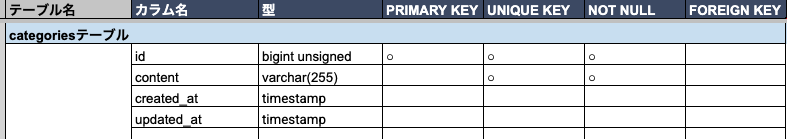
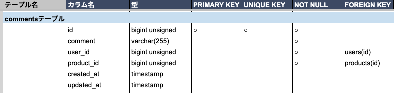
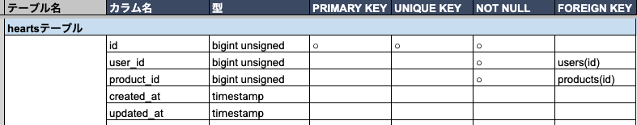
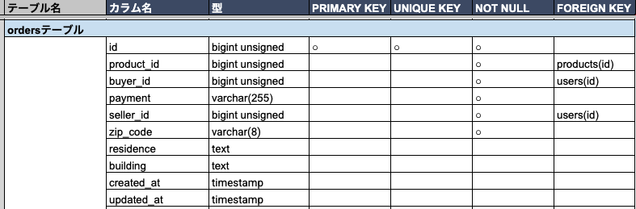
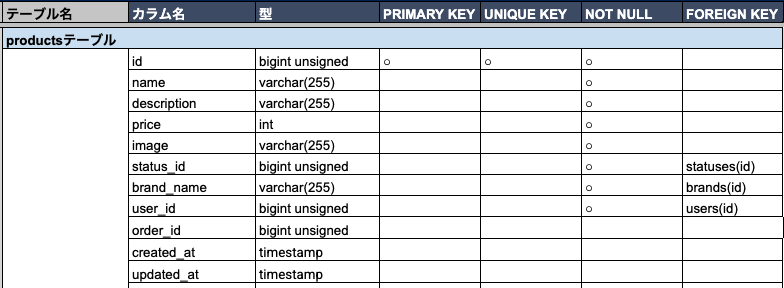
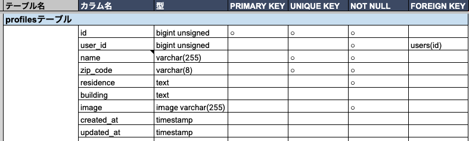
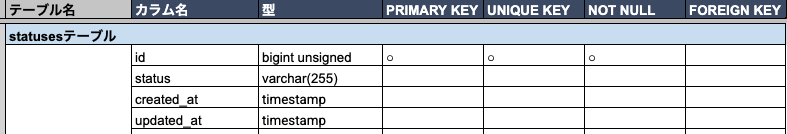
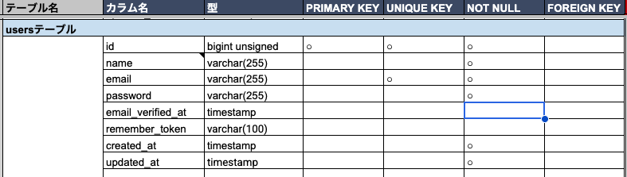
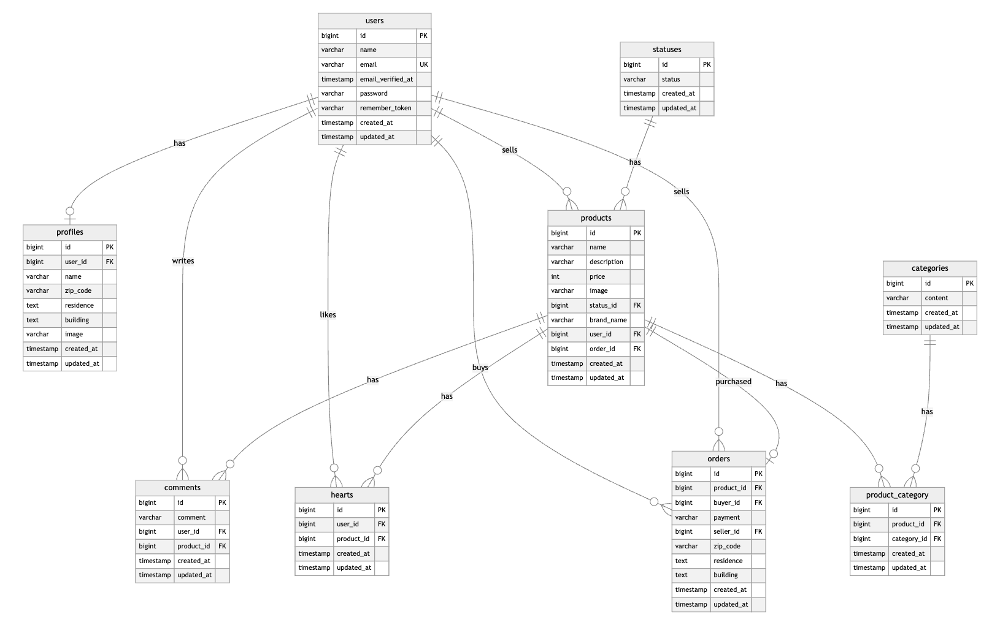

# coachtechフリマ

## 環境構築
**Dockerビルド**
1. リポジトリをクローン
```bash
git clone git@github.com:pekotarou/coachtech_frima_2.git
```
2. ディレクトリへ移動
```bash
cd coachtech_frima_2
```
3. Docker Desktopアプリを立ち上げる
4. Dockerコンテナをビルド・起動
```bash
docker compose up -d --build
```
> MacのM1・M2チップのPCの場合、`no matching manifest for linux/arm64/v8 in the manifest list entries` のメッセージが表示され、ビルドできないことがあります。  
> エラーが発生する場合は、`docker-compose.yml` ファイルの `mysql` 内に `platform` の項目を追加してください。

```yaml
mysql:
  platform: linux/x86_64(この文追加)
  image: mysql:8.0.26
```

---
**Laravel環境構築**
1. PHPコンテナに入る
```bash
docker compose exec php bash
```
2. Composerパッケージをインストール
```bash
composer install
```
3. `.env.example` ファイルをコピーして `.env` ファイルを作成
```bash
cp .env.example .env
```
4. `.env` に以下の環境変数を設定
```env
APP_NAME=Laravel
APP_ENV=local
APP_KEY=
APP_DEBUG=true
APP_URL=http://localhost

DB_CONNECTION=mysql
DB_HOST=mysql
DB_PORT=3306
DB_DATABASE=laravel_db
DB_USERNAME=laravel_user
DB_PASSWORD=laravel_pass

MAIL_MAILER=smtp
MAIL_HOST=mailhog
MAIL_PORT=1025
MAIL_USERNAME=null
MAIL_PASSWORD=null
MAIL_ENCRYPTION=null
MAIL_FROM_ADDRESS=test@example.com
MAIL_FROM_NAME="${APP_NAME}"

STRIPE_KEY=pk_test_xxxxxxxxxxxxxxxxxxxxx
STRIPE_SECRET=sk_test_xxxxxxxxxxxxxxxxxxxxx
```

> Stripeのキーは、各自のStripeテスト環境のAPIキーを設定してください。  
> `.env` ファイルはGit管理に含めないでください。

5. アプリケーションキーを作成
```bash
php artisan key:generate
```

6. マイグレーションとシーディングを実行
```bash
php artisan migrate:fresh --seed
```

7. シンボリックリンクを作成
```bash
php artisan storage:link
```

8. 商品画像用ディレクトリを作成
```bash
mkdir -p storage/app/public/products
```

9. productsのディレクトリに商品画像（ダミーデータ）を配置
```text
src/storage/app/public/products/
```
ダミーデータの商品画像は以下からダウンロードしてください。
https://docs.google.com/spreadsheets/d/1KYQkgTR_dRlplSieF90DU_dFBklgorZKV0ZZNDHkIns/edit?gid=1952069169#gid=1952069169&range=G5:G14

配置例：

```text
src/storage/app/public/products/watch.jpg
src/storage/app/public/products/hdd.jpg
src/storage/app/public/products/onion.jpg
src/storage/app/public/products/leather-shoes.jpg
src/storage/app/public/products/laptop.jpg
src/storage/app/public/products/microphone.jpg
src/storage/app/public/products/shoulder-bag.jpg
src/storage/app/public/products/tumbler.jpg
src/storage/app/public/products/coffee-mill.jpg
src/storage/app/public/products/makeup-set.jpg
```

プロフィール画像は、プロフィール設定時に以下へ自動保存されます。

```text
src/storage/app/public/profiles/
```

---

## 使用技術（実行環境）
- PHP 8.x
- Laravel 8.83.8
- MySQL 8.0.26
- Nginx
- Docker / Docker Compose
- Laravel Fortify
- Mailhog
- Stripe
- PHPUnit

---

## テーブル設計
テーブル設計は以下を参照してください。




.png)





---

## ER図
ER図は以下の画像を参照してください。



---

## URL
- 開発環境：http://localhost/
- phpMyAdmin：http://localhost:8080/
- Mailhog：http://localhost:8025/

---

## ダミーデータについて
シーディング実行後、以下のデータが作成されます。
- ユーザー
- 商品状態
- カテゴリー
- 商品データ

商品画像はGit管理に含めていないため、以下のディレクトリに画像を配置してください。
```text
src/storage/app/public/products/
```
商品画像ファイル名はSeederの `image` カラムに合わせてください。

例：

```text
products/watch.jpg
products/hdd.jpg
products/onion.jpg
products/leather-shoes.jpg
products/laptop.jpg
products/microphone.jpg
products/shoulder-bag.jpg
products/tumbler.jpg
products/coffee-mill.jpg
products/makeup-set.jpg
```

※テストユーザー1人分を以下にて設定しています。必要に応じて使用するか、使用しない場合は削除してください。
- パス：src/database/seeders/UserSeeder.php
- name：テストユーザー
- email：'test@example.com
- ログイン時のパスワード：password
---

## メール認証について
本アプリでは、会員登録時にメール認証を行います。
メール確認にはMailhogを使用しています。
1. 会員登録を行う
2. メール認証誘導画面へ遷移
3. Mailhogを開く
4. 認証メール内のリンクをクリック
5. プロフィール設定画面へ遷移

Mailhog URL：
```text
http://localhost:8025
```

認証メール再送機能も実装しています。

---

## Stripe決済について
本アプリでは、商品購入時にStripe Checkoutへ接続します。

### カード支払い
カード支払いでは、Stripeのテスト決済画面へ遷移します。  
テスト決済完了後、注文情報が `orders` テーブルに保存され、商品がSold表示になります。
テスト決済時のカード番号は以下を使用してください。その他の数値は任意で問題ありません。
```
カード番号：4242 4242 4242 4242
有効期限：12/34 など未来の日付
CVC：123 など任意の3桁
名前・住所など：任意
```

### コンビニ支払い
コンビニ支払いでは、Stripe Checkoutのコンビニ支払い手順画面へ遷移します。  
コンビニ支払いは非同期決済のため、支払い完了後の自動反映にはWebhook実装が必要です。
本アプリでは、コンビニ支払いについてはStripeの支払い手順画面への遷移までを実装しています。

---

## テスト環境構築
PHPUnitテストを実行するため、テスト用のデータベースと `.env.testing` を作成します。
`.env.testing` はGit管理に含めていないため、クローン後に作成してください。

### 1. テスト用データベースの作成
MySQLコンテナに入ります。
```bash
docker compose exec mysql mysql -u root -p
```

パスワードは以下です。

```text
root
```

MySQLにログイン後、テスト用データベースを作成します。
```sql
CREATE DATABASE laravel_test;
```

作成できたか確認します。
```sql
SHOW DATABASES;
```

終了します。

```sql
exit;
```

---

### 2. `.env.testing` の作成
PHPコンテナ内で、`.env` をコピーして `.env.testing` を作成します。
```bash
docker compose exec php cp .env .env.testing
```
`.env.testing` の以下を変更します。
```env
APP_ENV=testing
APP_KEY=

DB_CONNECTION=mysql
DB_HOST=mysql
DB_PORT=3306
DB_DATABASE=laravel_test
DB_USERNAME=root
DB_PASSWORD=root
```

---

### 3. テスト用アプリケーションキーの作成
```bash
docker compose exec php php artisan key:generate --env=testing
```

---

### 4. 設定キャッシュの削除
```bash
docker compose exec php php artisan config:clear
```

---

### 5. テスト用DBにマイグレーションとシーディングを実行
```bash
docker compose exec php php artisan migrate:fresh --seed --env=testing
```

---

## PHPUnitテスト
PHPUnitを用いたFeatureテストを実装しています。

### テスト対象

- 会員登録機能
- ログイン機能
- メール認証機能
- 商品一覧表示機能
- 商品検索機能
- 商品詳細表示機能
- 商品出品機能
- 商品購入前チェック機能
- 送付先住所変更機能
- いいね機能
- マイリスト表示機能
- コメント送信機能
- プロフィール設定機能
- マイページ表示機能

### テスト実行前の準備
テスト実行前に、テスト用データベースと `.env.testing` を作成してください。

```bash
docker compose exec php php artisan migrate:fresh --seed --env=testing
```

### テスト実行コマンド
全テストを実行する場合：
```bash
docker compose exec php vendor/bin/phpunit
```

個別にテストを実行する場合：
```bash
docker compose exec php vendor/bin/phpunit tests/Feature/Auth/RegisterTest.php
```

### テスト実行結果
```text
OK (49 tests, 126 assertions)
```

※テストケース一覧（https://docs.google.com/spreadsheets/d/1KYQkgTR_dRlplSieF90DU_dFBklgorZKV0ZZNDHkIns/edit?gid=203296433#gid=203296433&range=E31:F32）
の、ID9にある以下①と②のテスト内容とテスト手順が逆だと思われましたので、それぞれテスト内容に合うテスト手順にしました。  
①コメントが入力されていない場合、バリデーションメッセージが表示される  
→1. ユーザーにログインする > 2. 255文字以上のコメントを入力する > 3. コメントボタンを押す"  
②コメントが255字以上の場合、バリデーションメッセージが表示される  
→1. ユーザーにログインする > 2. コメントボタンを押す

※PurchaseRequest.php（https://docs.google.com/spreadsheets/d/1KYQkgTR_dRlplSieF90DU_dFBklgorZKV0ZZNDHkIns/edit?gid=574125123#gid=574125123&range=D62:E62）
の配送先ルールに選択必須と記載がありますが、選択する箇所がないので、配送先の住所の記載を必須にしました。

---

## ログイン試行回数について
開発中のエラー文確認のため、ログイン試行回数を一時的に増やしています。
該当ファイル：
```text
src/app/Providers/FortifyServiceProvider.php
```

該当箇所：
```php
RateLimiter::for('login', function (Request $request) {
    $email = (string) $request->email;

    return Limit::perMinute(30)->by(
        Str::lower($email) . '|' . $request->ip()
    );
});
```

不要な場合は、上記の処理と関連するuse文を削除してください。

---

## アプリについて
本アプリは、Laravelを使用したフリマアプリです。
主な機能は以下です。

- 会員登録
- ログイン
- メール認証
- プロフィール設定
- 商品一覧表示
- 商品検索
- 商品詳細表示
- 商品出品
- 商品購入
- 送付先住所変更
- いいね
- マイリスト
- コメント
- マイページ

---

## 使い方
1. サイトにアクセス
```text
http://localhost/
```
2. 会員登録を行う
3. Mailhogで認証メールを確認する
```text
http://localhost:8025
```
4. メール認証を完了する
5. プロフィール設定を行う
6. 商品一覧画面から商品を確認する
7. 商品を出品する場合は、ヘッダーの「出品」から商品情報を登録する
8. 商品を購入する場合は、商品詳細画面から「購入手続きへ」を押し、支払い方法を選択する
9. いいねした商品は、商品一覧画面の「マイリスト」タブで確認できる
10. 購入した商品・出品した商品は、マイページで確認できる

